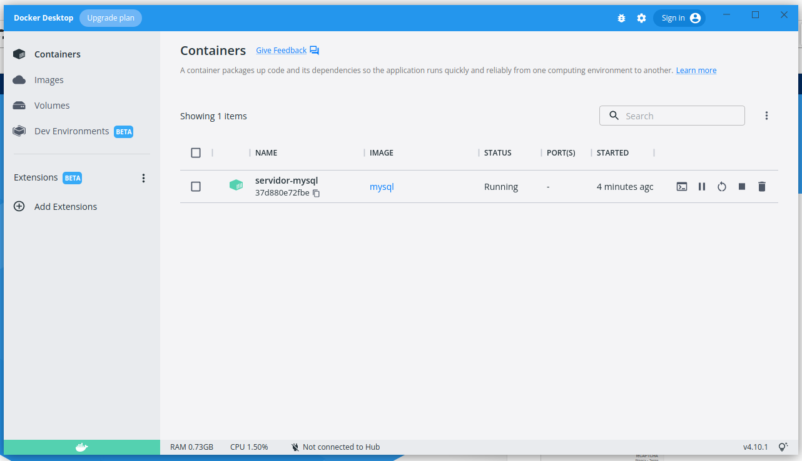

# Instalação do Docker Desktop no Linux Ubuntu 22.04

## A instalção foi feita em uma máquina virtual usando VirtualBox

### Virtual Box

<div align="center">
    
   </div>

    VirtualBox é um software de virtualização desenvolvido pela empresa Innotek, comprado pela Sun Microsystems, que por fim, foi comprada pela Oracle.

    É indicado tanto para pessoas físicas quanto para jurídicas de qualquer porte ou segmento, visando um bom desempenho em hardwares x86, voltado então para servidores, desktops e uso integrado.

    https://download.virtualbox.org/virtualbox/6.1.36/VirtualBox-6.1.36-152435-Win.exe


    ### Após a instalação e criação da máquina virtual para o sistema Ubuntu,você deve acessar as configurações da máquina , ir ao item sistema, clicar na guia
     processador e habilitar "Habilitar VT-x/AMD-V Aninhado

### Linux Ubuntu 22.04
<div align="center">

    

</div>


    Ubuntu é um sistema operacional ou sistema operativo de código aberto, construído a partir do núcleo Linux, baseado no Debian e utiliza GNOME como ambiente de desktop de sua mais recente versão com suporte de longo prazo. Esta distribuição Linux é desenvolvida pela Canonical Ltd.

    https://ubuntu.com/download/desktop/thank-you?version=22.04&architecture=amd64

### Docker
<div align="center">
    

</div>
    Docker é um conjunto de produtos de plataforma como serviço que usam virtualização de nível de sistema operacional para entregar software em pacotes chamados contêineres. Os contêineres são isolados uns dos outros e agrupam seus próprios softwares, bibliotecas e arquivos de configuração.

## Configuração e instalação do ambiente

### Pós-Instalação do linux

    Após a instalação do linux Ubuntu 22.04, você deve executar
    alguns comandos para atualizar o sistema e deixá-lo preparado
    para a instalação do docker.

### Atualização dos pacotes
``` console
$ sudo apt update
```

### Atualização do sistema
``` console
$ sudo apt upgrade
```

### Reinicie o sistema
``` console
$ reboot
```

### Instalação do Docker desktop

    Download do docker desktop
    https://desktop.docker.com/linux/main/amd64/docker-desktop-4.10.1-amd64.deb?utm_source=docker&utm_medium=webreferral&utm_campaign=docs-driven-download-linux-amd64

    Na pasta(diretório) download localize o arquivo docker-desktop-4.10.1-amd64.deb e assim você pode instalar de duas maneiras, sendo:
     1º - Clicar com o botão direito do mouse sobre o arquivo e escolhe Software Install

     2º - Abrir o terminal e ir até a pasta(diretório) download e executar o comando de instalação:
``` console
$ sudo apt install ./docker-desktop-4.10.1-amd64.deb
```

### Caso retorne mensagem de erro referente ao docker-ce e/ou docker-cli, execute os comandos abaixo:
``` console
$ sudo apt update
$ sudo apt-get install \
ca-certificates \
curl \
gnupg \
lsb-release
```
            Adicionar as chaves de GPG oficiais do docker
``` console
$ sudo mkdir -p /etc/apt/keyrings
$ curl -fsSL https://download.docker.com/linux/ubuntu/gpg | sudo gpg --dearmor -o /etc/apt/keyrings/docker.gpg
```
            Use o comando abaixo para carregar o repositório de pacotes
``` console
$ echo \
"deb [arch=$(dpkg --print-architecture) signed-by=/etc/apt/keyrings/docker.gpg] https://download.docker.com/linux/ubuntu \
$(lsb_release -cs) stable" | sudo tee /etc/apt/sources.list.d/docker.list > /dev/null
```
### Instalação do Docker Engine
``` console
$ sudo apt-get update
$ sudo apt-get install docker-ce docker-ce-cli containerd.io docker-compose-plugin
```
### Após a instalação das dependências você deve executar  o comando de instalação do docker desktop
``` console
$ sudo apt install ./docker-desktop-4.10.1-amd64.deb
```

## Instalando a Imagem e o Container de MySQL no docker

### Vamos usar volume neste exemplo

    Crie uma pasta(diretório) chamada data_docker, no home do usuário, execute o seguinte comando:
``` console
$ docker run --name servidor-mysql -v ~/data_docker:/var/lib/mysql -e MYSQL_ROOT_PASSWORD=alunos@123 -d mysql:8.0.29
```
    Agora, abra o docker-destok e veja o seu container rodando.
    
<div align="center">

</div>
    
    
